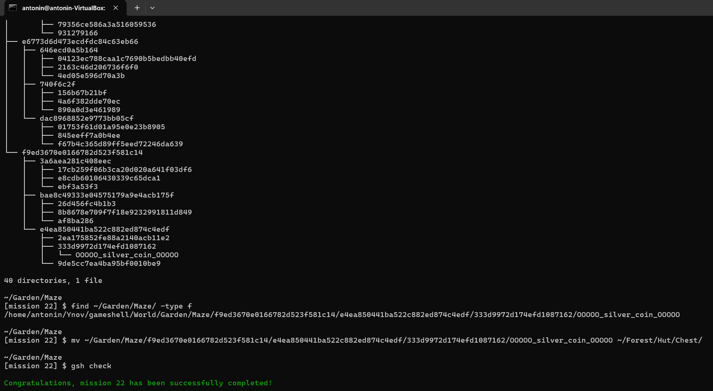

# Exam Administration Poste Client

### Mission 1

> On doit aller tout en haut du donjon, on utilise `cd Castle/Main_tower/First_floor/Top_of_the_tower` pour y aller.

### Mission 2

> On doit aller dans le cellar. On fait `cd Castle/Cellar` pour y aller.

### Mission 3

> Nous devons revenir au point de départ. On utilise `cd` pour le point de départ. Ensuite on fait `cd Castle/Main_building/Throne_room/` pour aller dans la pièce du trône puis mission validée.

### Mission 4

> Nous devons créer une maison avec un coffre dedans, dans la forêt. On utilise `mkdir Hut` pour créer la maison, puis `cd Hut` pour entrer dedans et enfin `mkdir Chest` pour créer le coffre.

### Mission 5

> Nous devons se débarrasser des araignées dans le cellar du chateau. On utilise `cd Castle/Cellar` pour aller dans le cellar, puis `rm spider_1 && rm spider_2 && rm spider_3` pour les eliminer.

### Mission 6

> On doit collecter toutes les pièces qui se trouvent devant le chatêau dans le jardin. On utilise `cd Garden` pour aller dans le jardin, puis `mv coin_1 coin_2 coin_3 ~/Forest/Hut/Chest` pour déplacer les pièces dans le coffre de la maison.

### Mission 7

> On doit collecter toutes les pièces cachées qui se trouvent devant le château dans le jardin. On utilise `cd Garden` pour aller dans le jardin, puis `mv hidden_coin_1 hidden_coin_2 hidden_coin_3 ~/Forest/Hut/Chest` pour déplacer les pièces dans le coffre de la maison.

### Mission 8

> On doit à nouveau tuer toutes les araignées mais mtn elles sont nombreuses ces coquines ! On utilise `cd Castle/Cellar` pour aller dans le cellar, puis `rm *spider*` pour les eliminer toutes en une seule commande. `*` est un joker qui permet de sélectionner tous les fichiers contenant "spider" dans leur nom car évidemment, elles ont toutes des chiffres différents !

### Mission 9

> Je pensais que cela allait être terminé, mais elles sont revenues ces araignées, et en plus en étant cachées ! On utilise `cd Castle/Cellar` pour aller dans le cellar, puis `rm .*spider*` pour les eliminer toutes en une seule commande. `.*` est un joker qui permet de sélectionner tous les fichiers commençant par un point et contenant "spider" dans leur nom car évidemment.

### Mission 10

> On doit voler les étendars dans le hall du chateau. On utilise `cd Castle/Great_Hall` pour aller dans le hall, puis `cp standard_1 standard_2 standard_3 standard_4 ~/Forest/Hut/Chest` pour copier les étendars sans y toucher dans le coffre de la maison.

### Mission 11

> On doit à nouveau voler les tapestry dans le hall du chateau. On utilise `cd Castle/Great_Hall` pour aller dans le hall, puis `cp *tapestry* ~/Forest/Hut/Chest` pour copier les tapestry sans y toucher dans le coffre de la maison. `*` est un joker qui permet de sélectionner tous les fichiers contenant "tapestry" dans leur nom.

### Mission 12

> On doit aller au premier étage du chateau et dérober la plus vieille peinture. On utilise `cd Castle/First_Floor` pour aller au premier étage. On fait ensuite `ls -l` pour voir des informations sur les peintures. Puis `cp oldest_painting ~/Forest/Hut/Chest` pour copier la peinture sans y toucher dans le coffre de la maison.

### Mission 13

> Un frérot a prédit la fin du monde un jour, notamment le 18 février 1919. Mais on sait pas quel jour de la semaien c'était. Du coup on fait la commande `cal 02 1919` pour afficher le calendrier de février 1919 et on voit que c'était un mardi.

### Mission 14

> On doit créer un alias pour la commande `ls -A`. On fait `alias la='ls -A'` pour créer l'alias `la` qui fera la commande `ls -A`.

### Mission 15

> Je dois créer un fichier nommé `journal.txt` dans mon coffre. Du coup j'utilise la commande `nano ~/Forest/Hut/Chest/journal.txt` pour créer et éditer le fichier `journal.txt` dans le coffre de la maison. Ensuite j'écris du texte et je sauvegarde avec `CTRL + O` puis je quitte avec `CTRL + X`.

### Mission 16

> On veut créer un alias pour éditer le fichier `journal.txt` dans le coffre de la maison en étant où on veut. On fait `alias journal='nano ~/Forest/Hut/Chest/journal.txt'` pour créer l'alias `journal` qui fera la commande `nano ~/Forest/Hut/Chest/journal.txt`.

### Mission 17

> On doit en maximum 20 secondes aller dans la truc de la reine araignée et la tuer. Le soucis c'est que les noms de fichiers sont horribles donc on doit utiliser tab. On fait `cd Castle/Cellar` puis `rm queen_spider` en utilisant tab pour compléter les noms de fichiers.

### Mission 18

> SKIP de la mission car dépendances manquantes.

### Mission 19

> On doit montrer au pyrotechnicien, 3 feux d'artifices en MEME temps. On utilise la commande `gsh check & flarigo & flarigo & flarigo` pour lancer les 3 feux d'artifices en même temps. Le `&` permet de lancer une commande en arrière plan.

### Mission 20

> On doit trouver la bonne combinaison de feux d'artifices pour faire un beau spectacle. On utilise la commande `charmiglio aaaa` pour lancer un feu d'artifice avec la combinaison `aaaa`. On essaye ensuite toutes les combinaisons possibles jusqu'à trouver la bonne.

### Mission 21

> On doit trouver la pièce de cuivre dans le labyrinthe du jardin. On utilise la commande `find ~/Garden/Maze -type f` pour chercher le fichier `copper_coin` dans le dossier `Maze`. Ensuite on le copie avec `mv ~/Garden/Maze/../copper_coin ~/Forest/Hut/Chest` pour le mettre dans le coffre de la maison.

### Mission 22

> On doit trouver la pièce d'argent dans le labyrinthe du jardin. On utilise la commande `find ~/Garden/Maze -type f` pour chercher le fichier `silver_coin` dans le dossier `Maze`. Ensuite on le copie avec `mv ~/Garden/Maze/../silver_coin ~/Forest/Hut/Chest` pour le mettre dans le coffre de la maison. On peut aussi utiliser `tree` pour afficher l'arborescence du dossier `Maze` et trouver le fichier.

### Mission 23

> On doit trouver les pièces d'or dans le labyrinthe du jardin. On utilise la commande `find ~/Garden/Maze -type f` pour chercher les fichiers `gold_coin` dans le dossier `Maze`. Ensuite on les copie avec `mv ~/Garden/Maze/../gold_coin ~/Forest/Hut/Chest` pour le mettre dans le coffre de la maison.

### Mission 24

> On doit aider l'hermite à retrouver la recette de son herbal tea. On va dans la cave avec lui avec la commande `cd ~/Mountain/Cave`, puis on utilise la commande `ls` pour voir ce qu'il s'y trouve. On voit qu'il y a l'hermite ainsi qu'un dossier des récettes de potions. On va dedans avec la commande `cd Book_of_potions`, puis on utilise la commande `ls` pour voir ce qu'il y a dedans. On voit qu'il y a plusieurs fichiers, on utilise la commande `cat table_of_content` pour afficher le contenu du fichier du sommaire. On voit que la recette de herbal tea se trouve dans le fichier `page_07`. On peut confirmer cela avec la commande `cat page_07` pour afficher le contenu du fichier. On retourne dans avec l'hermite avec la commande `cd ../` puis on fait la commande `head -n 8 Book_of_potions/page_07` pour afficher les 8 premières lignes du fichier `page_07` et on voit que c'est bien la recette de herbal tea. Enfin, on exécute la commande `gsh check` pour donner la recette à l'hermite.

### Mission 25

