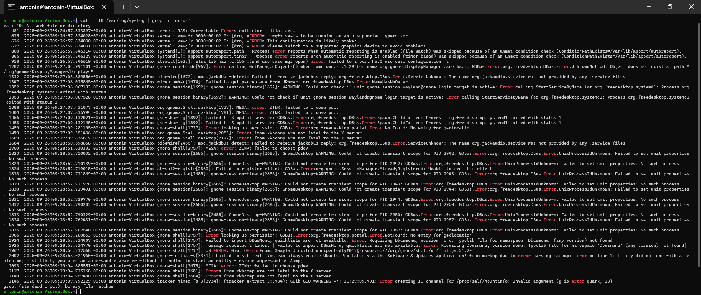

# Exercice 1 - Débutant

## Consignes

1. Créer un fichier log.txt qui contient la liste des fichiers de /etc
2. Ajoute dans ce fichier les 10 dernières lignes du fichier /var/log/syslog
3. Affichez moi seulement les lignes qui contiennent le mot "error" dans le fichier /var/log/syslog

<hr>

### Étape 1 : Création du fichier log.txt

> La commande `ls` permet de lister les fichiers et répertoires d'un dossier. Le symbole `>` permet de rediriger la sortie d'une commande vers un fichier, en l'occurence log.txt.

```bash 
ls /etc > log.txt
```


<hr>

### Étape 2 : Ajout des 10 dernières lignes du fichier /var/log/syslog

> La commande `tail` permet d'afficher les dernières lignes d'un fichier. L'option `-n` permet de spécifier le nombre de lignes à afficher. Le symbole `>>` permet d'ajouter la sortie d'une commande à la fin d'un fichier.

```bash
tail -n 10 /var/log/syslog >> log.txt
```


<hr>

### Étape 3 : Affichage des lignes contenant le mot "error"

> La commande `grep` permet de rechercher des lignes contenant un motif spécifique dans un fichier. L'option `-i` permet de rendre la recherche insensible à la casse (majuscules/minuscules).

```bash
cat /var/log/syslog | grep -i "error"
```

