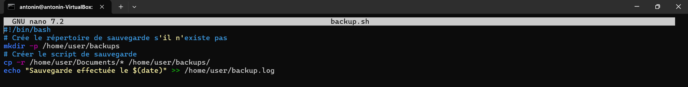
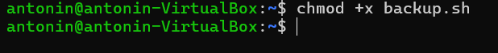
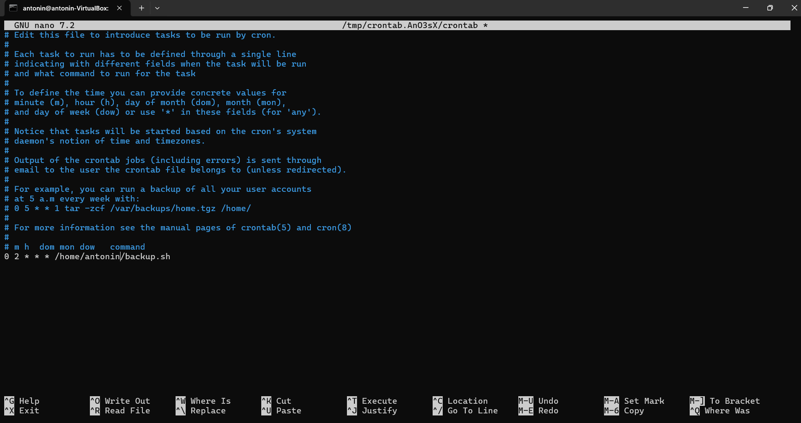

# Exercice 4 - Intermédiaire

## Consignes

1. Créer un script bash qui sauvegarde automatiquement le contenu de /home/user/Documents dans /home/user/backups
2. Execute ce script tous les jours à 2h

<hr>

### Étape 1 : Création du script de sauvegarde

> J'utilise un éditeur de texte comme `nano` ou `vim` pour créer un script bash nommé `backup.sh`. Ce script doit copier le contenu du répertoire `/home/user/Documents` vers `/home/user/backups`. Je dois m'assurer que le répertoire de destination existe avant d'exécuter la commande de copie.

```
nano backup.sh
```

```bash
#!/bin/bash
# Crée le répertoire de sauvegarde s'il n'existe pas
mkdir -p /home/user/backups
# Créer le script de sauvegarde
cp -r /home/user/Documents/* /home/user/backups/
echo "Sauvegarde effectuée le $(date)" >> /home/user/backup.log
```


<hr>

### Étape 2 : Rendre le script exécutable

> J'utilise la commande `chmod` pour rendre le script exécutable.

```bash
chmod +x backup.sh
```



<hr>

### Étape 3 : Planification de l'exécution du script avec cron

> J'utilise la commande `crontab -e` pour éditer la table des tâches cron. J'ajoute une ligne pour exécuter le script `backup.sh` tous les jours à 2h du matin.

```bash
0 2 * * * /home/user/backup.sh
```



