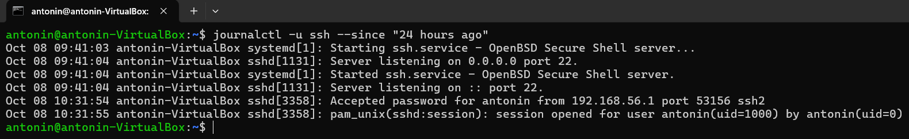
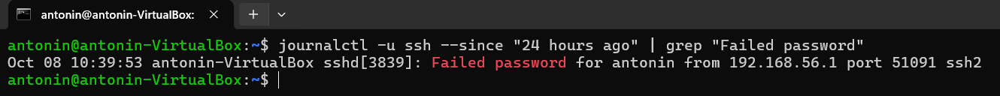

# Exercice 5 - Intermédiaire

## Consignes

1. Afficher les logs du service ssh sur les 24 dernières heures.
2. Filtre les logs pour avoir que les connexions ratées.
3. Sauvegarde tout dans un fichier sshd_failed_logins.txt

<hr>

### Étape 1 : Affichage des logs du service ssh

> Utilisez la commande `journalctl` pour afficher les logs du service ssh. La commande suivante affiche les logs des dernières 24 heures.

```bash
journalctl -u ssh --since "24 hours ago"
```



<hr>

### Étape 2 : Filtrage des connexions ratées

> Utilisez la commande `grep` pour filtrer les logs et n'afficher que les connexions ratées. La chaîne de caractères "Failed password" est généralement utilisée pour identifier ces tentatives.

```bash
journalctl -u ssh --since "24 hours ago" | grep "Failed password"
```



<hr>

### Étape 3 : Sauvegarde des logs filtrés dans un fichier

> Redirigez la sortie de la commande filtrée vers un fichier nommé `sshd_failed_logins.txt`.

```bash
journalctl -u ssh --since "24 hours ago" | grep "Failed password" > sshd_failed_logins.txt
```


