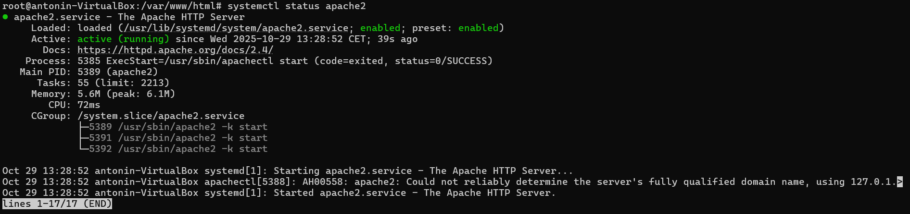
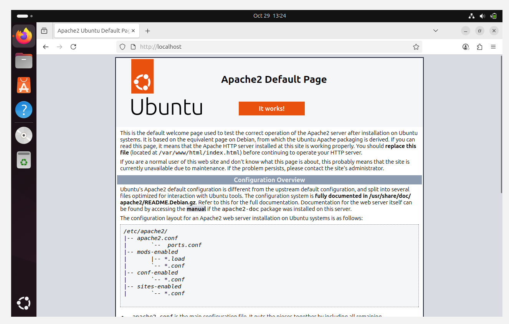
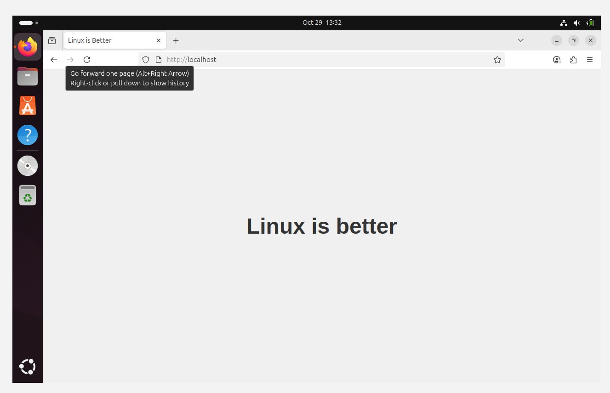
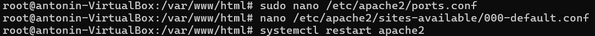
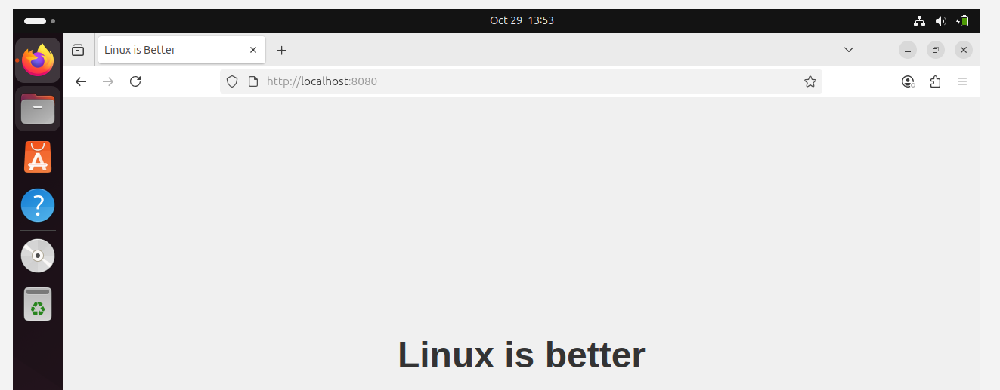
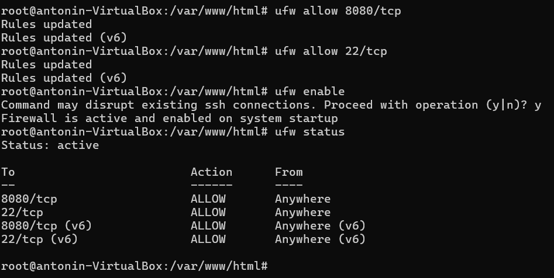

# TP 1

## Consignes

### **1. Installation et configuration d’un serveur web**

1. Installer Apache, lancer le et vérifier son statut.
2. Configurer le serveur pour servir une page web simple.
c. Vérifier que le serveur est accessible localement via un navigateur.
d. Modifier la configuration pour que le serveur réponde sur un port non standard (ex: 8080).

### **2. Configuration du pare-feu avec  UFW**

1. Configurer un pare-feu pour n’autoriser que les connexions sur le port du serveur web (ex : 8080) et SSH (port 22).
2. Bloquer toutes les autres connexions entrantes.
3. Tester les règles en essayant de se connecter via d’autres ports.

### **3. Sécurisation des connexions SSH**

1. Configurer votre vm pour accepter que les connexions via clefs ssh
2. Désactiver le login de l’utilisateur root sur ssh

### Bonus :

Faites moi un script bash qui fait toutes vos commandes pour que j’arrive au meme statut que vous à la fin de l’étape 3.B

### Étape 1 : Installation et lancement d'Apache

> La commande `apt-get install` permet d'installer des paquets sur les systèmes basés sur Debian. La commande `systemctl` permet de gérer les services système.

```bash
sudo apt-get update
sudo apt-get install apache2
sudo systemctl start apache2
sudo systemctl enable apache2
sudo systemctl status apache2
```



<hr>

### Étape 2 : Configuration du serveur pour servir une page web simple et vérification locale

> Le répertoire par défaut pour les fichiers web dans Apache est `/var/www/html`. Nous allons créer un fichier `index.html` simple pour servir une page web.

```bash
# On copie le fichier index.html dans le répertoire web d'Apache
```




<hr>

### Étape 3 : Modification de la configuration pour répondre sur un port non standard

> Nous allons modifier le fichier de configuration d'Apache pour qu'il écoute sur le port 8080 au lieu du port 80 par défaut.

```bash
sudo nano /etc/apache2/ports.conf
```

> On ajoute la ligne suivante pour écouter sur le port 8080 :

```
Listen 8080
```

> Ensuite, on modifie le fichier de configuration du site par défaut :

```bash
sudo nano /etc/apache2/sites-available/000-default.conf
```

> On change la ligne suivante :

```
<VirtualHost *:80>
```

> En :

```
<VirtualHost *:8080>
```

> Enfin, on redémarre Apache pour appliquer les modifications :

```bash
sudo systemctl restart apache2
```




<hr>

### Étape 4 : Configuration du pare-feu avec UFW

> UFW (Uncomplicated Firewall) est un outil pour gérer le pare-feu sur les systèmes basés sur Debian. Nous allons configurer UFW pour n'autoriser que les connexions sur le port 8080 et le port SSH (22).

```bash
sudo ufw allow 8080/tcp
sudo ufw allow 22/tcp
sudo ufw enable
sudo ufw status
```



<hr>

### Étape 5 : Sécurisation des connexions SSH

> Nous allons configurer SSH pour n'accepter que les connexions via clés SSH et désactiver le login de l'utilisateur root.

```bash
sudo nano /etc/ssh/sshd_config
```

> On modifie ou ajoute les lignes suivantes :

```
PubkeyAuthentication yes
PasswordAuthentication no
PermitRootLogin no
```

> Ensuite, on redémarre le service SSH pour appliquer les modifications :

```bash
sudo systemctl restart ssh
```

<hr>

### Bonus : Script bash pour automatiser les étapes

> Script bash qui automatise les étapes précédentes :

```bash
#!/bin/bash
# Mise à jour et installation d'Apache
sudo apt-get update
sudo apt-get install apache2
sudo systemctl start apache2
sudo systemctl enable apache2
sudo systemctl status apache2
# Configuration du serveur web
echo "<html><body><h1>Linux is better than Windows</h1></body></html>" | sudo tee /var/www/html/index.html
# Modification du port d'écoute
sudo sed -i 's/80/8080/g' /etc/apache2/ports.conf
sudo sed -i 's/<VirtualHost \*:80>/<VirtualHost \*:8080>/g' /etc/apache2/sites-available/000-default.conf
sudo systemctl restart apache2
# Configuration du pare-feu
sudo ufw allow 8080/tcp
sudo ufw allow 22/tcp
sudo ufw enable
sudo ufw status
# Sécurisation des connexions SSH
sudo sed -i 's/#PubkeyAuthentication yes/PubkeyAuthentication yes/g' /etc/ssh/sshd_config
sudo sed -i 's/PasswordAuthentication yes/PasswordAuthentication no/g' /etc/ssh/sshd_config
sudo sed -i 's/PermitRootLogin yes/PermitRootLogin no/g' /etc/ssh/sshd_config
sudo systemctl restart ssh
```