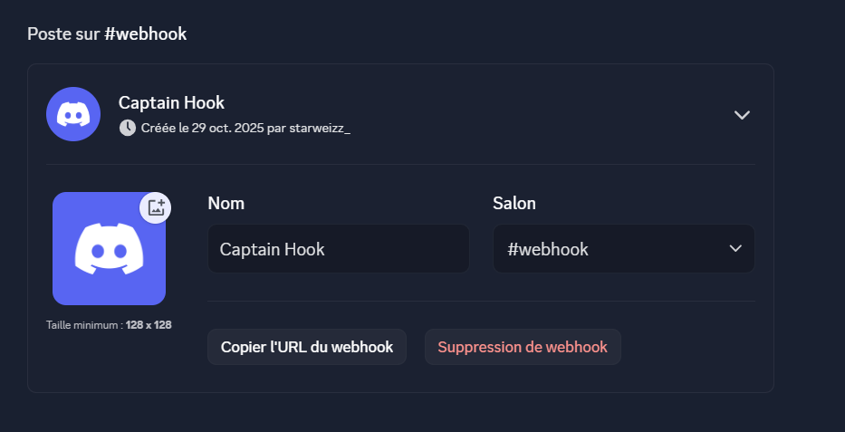

# TP 2

## Consignes

### **1. Préparation et configuration du webhook**

1. Créer un webhook sur un serveur Discord dédié aux alertes de sécurité.
2. Récupérer l’URL du webhook pour l’utiliser dans les scripts d’alerte.

### **2. Surveillance des accès à des fichiers sensibles**

1. Identifier un fichier sensible (par exemple : `/etc/secret.txt`).
2. Configurer un mécanisme de surveillance pour détecter tout accès en lecture à ce fichier.
3. Utiliser `inotify` pour surveiller le fichier et déclencher un script Bash lorsqu’un accès est détecté.
4. Le script enverra une alerte Discord via le webhook.

### **3. Surveillance des connexions SSH hors des horaires de bureau**

1. Les horaires de bureau sont définis entre 9h00 et 18h00.
2. Surveiller les connexions SSH en dehors de ces horaires en analysant les logs du service SSH.
3. Configurer un script qui analyse le fichier de log `/var/log/auth.log` ou utilise `journalctl` pour repérer les connexions hors de cette plage horaire.
4. Si une connexion est détectée en dehors des heures de bureau, envoyer une alerte Discord via le webhook.

### **4. Automatisation avec cron pour une surveillance continue**

Configurer cron pour exécuter régulièrement les scripts :

1. Le script de surveillance d'accès au fichier doit tourner en arrière-plan en continu.
2. Le script de surveillance des connexions SSH doit être exécuté toutes les 5 minutes.

### Étape 1 : Installation des outils nécessaires

```bash
sudo apt-get update
sudo apt-get install inotify-tools curl
```

### Étape 2 : Création du webhook Discord

1. Aller dans les paramètres du serveur Discord.
2. Créer un nouveau webhook dans le canal dédié aux alertes de sécurité.
3. Copier l'URL du webhook pour l'utiliser dans les scripts.



<hr>

### Étape 3 : Script de surveillance d'accès au fichier sensible

```bash
#!/bin/bash
#!/bin/bash
FILE_TO_WATCH="/etc/secret.txt"
WEBHOOK_URL="https://discord.com/api/webhooks/YOUR_WEBHOOK_URL"

while inotifywait -e open "$FILE_TO_WATCH"; do
  curl -H "Content-Type: application/json" -X POST -d "{\"content\": \"🚨 Accès détecté au fichier secret: $FILE_TO_WATCH\"}" $WEBHOOK_URL
done
```

### Étape 4 : Script de surveillance des connexions SSH hors des horaires de bureau

```bash
#!/bin/bash
WEBHOOK_URL="https://discord.com/api/webhooks/YOUR_WEBHOOK_URL"

# Analyser les logs SSH pour détecter les connexions hors des horaires de bureau
grep -E "Accepted publickey for|Accepted password for" /var/log/auth.log | while read line; do
  # Extraire l'heure de la connexion
  HOUR=$(echo $line | awk '{print $1}' | cut -d: -f1)
  if [ "$HOUR" -lt 9 ] || [ "$HOUR" -gt 18 ]; then
    curl -H "Content-Type: application/json" -X POST -d "{\"content\": \"🚨 Connexion SSH détectée en dehors des heures de bureau: $line\"}" $WEBHOOK_URL
  fi
done
```

### Étape 5 : Configuration de cron pour l'automatisation

```bash
# Ajouter le script de surveillance des connexions SSH au cron
crontab -e
```
```bash
*/5 * * * * /path/to/ssh_monitoring_script.sh
```
```bash
# Lancer le script de surveillance d'accès au fichier en arrière-plan
nohup /path/to/file_access_monitoring_script.sh &
```
